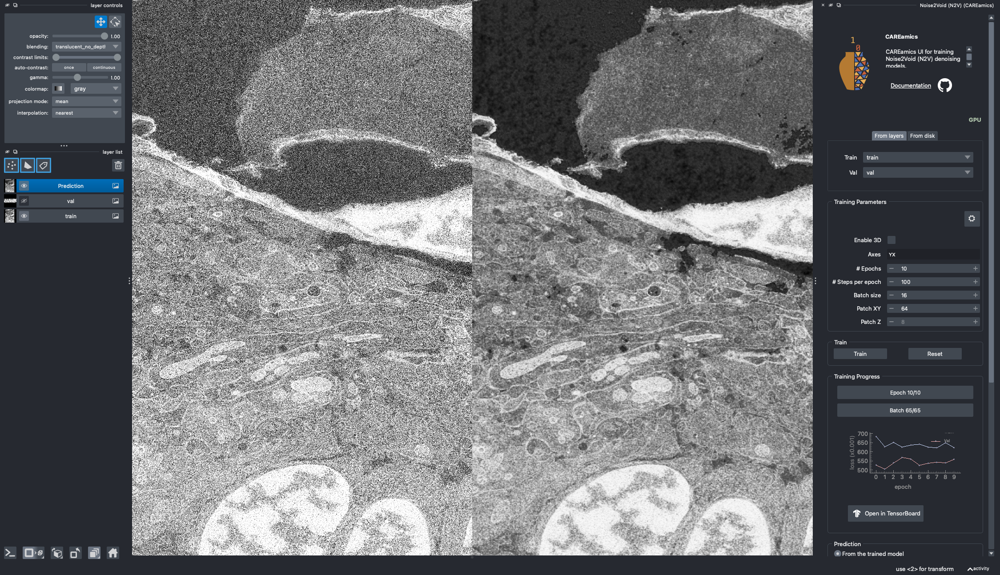
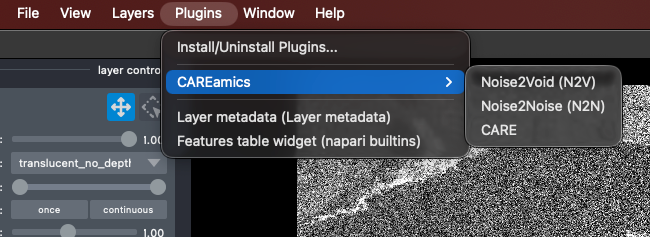
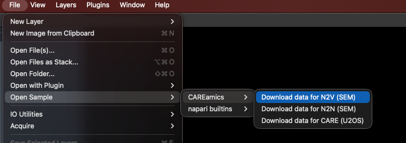
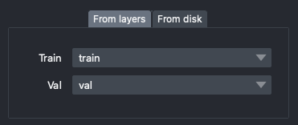
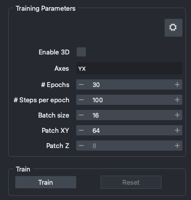
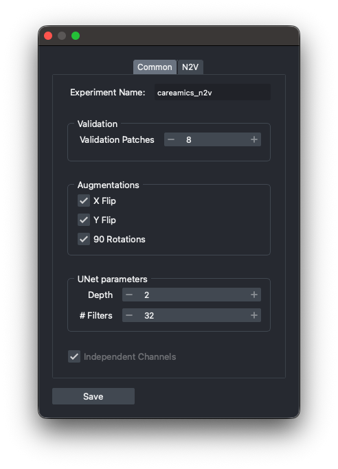
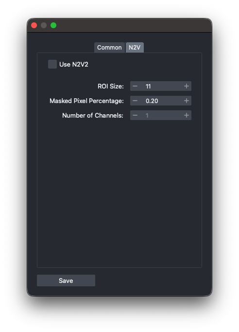
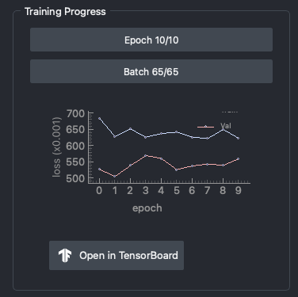
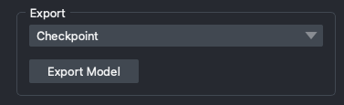

# CAREamics UI

CAREamics provides a napari plugin for running our algorithms with a friendly GUI. Check out the [installation instructions](../../installation/index.md) to get started.  

{width=640}
/// caption
N2V Widget Overview
///


## Overview
The CAREamics napari plugin currently supports [CARE](../../algorithms/care), [Noise2Noise](../../algorithms/n2n), and [Noise2Void](../../algorithms/noise2void) algorithms. For each algorithm, we provided a *widget* that you can load from the napari *Plugins* menu.  
All widgets are almost similar in UI. Here we describe main sections of a widget: 

1. **Data**: You can either use napari layers as input data or select a folder of images for that.
2. **Training Parameters**: Setting the training and algorithm specific parameters.
3. **Monitor Training Progress**: Monitor the training progress via a plot or TensorBoard.
4. **Prediction**: Predict on a layer or on files from a folder.
5. **Exporting Models**: Save the trained model for later use.


## Quick start
The easiest way to try out the plugin, is to start the plugin and load a sample dataset. You can do this by running the following command in your terminal:

```bash
napari
```

Then, from the napari *Plugins* menu, select *"CAREamics"* and then any of the three provided algorithms:

{width=450}
/// caption
Starting the plugin
///


For sample data, you can select and (down)load them from: *File > Open Sample > CAREamics*:

{width=500}
/// caption
Load sample data
///


## Plugin Walkthrough
In this section, we describe in more details the different elements of the UI.

!!! info "Having an issue?"
    In the header of widget, click on the Github icon to open an issue, we will be happy to help you!


!!! important "GPU / CPU indicator"
    Next to the algorithm name, you can see a **GPU** / **CPU** indicator. This indicates whether the algorithm is running on the GPU or CPU. If you have a compatible GPU, the algorithm will run on it by default. If not, it will run on the CPU.


### Data
Loading data can be done either by using images already loaded in napari (From layers), or by loading images from a folder (From disk). The plugin will automatically detect the file format and load the images accordingly. The tab that is selected tells the plugin the source of the data.

Unsurprisingly, the **`Train`** data is used for training, and the **`Val`** one for validation! When using CARE or Noise2Noise, additional target train and validation data are required.  

{width=360}
/// caption
Training Data
///

!!! important "Size of the validation data"
    If your validation data is too large, this will slow down training.


!!! tip "Split validation from training data"
    If you set the **`Val`** data to the same layers or folder as the **`Train`** data, `CAREamics` will automatically split the data. There are two parameters used to control the amount of data used for validation, these are found in the advanced settings.


!!! info "Loading from a folder"
    Loading from a folder will not show the images in napari.


### Training Parameters
After selecting the training data source, you can set the training parameters:

{width=350}
/// caption
Training Parameters
///

Here are the meaning of each of the parameters:  

- **`Enable 3D`**: runs the training in 3D. This is only available if you set a `Z` axis in `Axes`.
- **`Axes`**: enter here the axes of your data. Accepted values are `C`, `Z`, `Y`, `X`, `T` and `S`. 
- **`# Epochs`**: number of epochs for which to train the model. This parameter influences the total training time.
- **`# Steps per epoch`**: number of steps (batches) per epoch. An epoch will end after this number of steps. This parameter also influences the total training time.
- **`Batch size`**: number of images to use in each training step. This parameter influences the total training time, but also the GPU memory used.
- **`Patch XY`**: size of the patches to use in the XY plane. This parameter impacts the GPU memory used.
- **`Patch Z`**: size of the patches to use in the Z plane. This parameter impacts the GPU memory used. It is only available if you set a `Z` axis in `Axes`.

Click on **`Train`** to start training. Training can be stopped at any time by clicking on the **`Stop`** button. The trained model will be saved. You can then **`Reset`** the model to start training again from scratch.


!!! tip "What to do when GPU memory is limited?"
    Often times, you will run out of GPU memory when training a model. This is especially true for 3D data. In this case, you can try to reduce the `Patch XY` and `Patch Z` parameters. This will reduce the size of the images used for training, and thus reduce the GPU memory used. 
    If this is not sufficient, you can also try to reduce the `Batch size` parameter. This will reduce the number of images used for training at each step, and thus reduce the GPU memory used. 


### Advanced Settings
If you click on the *gear icon* in the top right corner of the training tab, you will see a list of advanced settings. These settings are not necessary to change for most users, but can be useful for advanced users.  

{width=300, align=left}
{width=300, align=right}
/// caption
Advanced Settings (Common and N2V specific)
///


The parameters are the following:

- **`Experiment name`**: name of the experiment used in the logs.
- `Validation`
    - **`Validation Patches`**: minimum number of patches or images used for validation.
- `Augmentations`
    - **`X Flip`**: uncheck to disable the X flip augmentation.
    - **`Y Flip`**: uncheck to disable the Y flip augmentation.
    - **`90 Rotations`**: uncheck to disable the 90 degree rotations augmentation.
- `UNet parameters`
    - **`Depth`**: depth of the UNet. Larger depth means more layers, and potentially a more powerful model. But it may also lead to overfitting, slower learning, and will take more memory on GPU.
    - **`# Filters`**: number of filters in the first layer of the UNet. Larger number means more filters, and potentially a more powerful model. But it may also lead to overfitting, slower learning, and will take more memory on GPU.

In advanced setting, there is another tab for algorithm specific setting. For example, in `N2V` widget, you can select the **`Use N2V2`** checkbox to use [N2V2](../../algorithms/n2v2) rather than Noise2Void.


### Monitoring Training Progress
While training, you can monitor the training progress via a plot or TensorBoard. Click on **`Open in TensorBoard`** to access the TensorBoard UI. 

{width=400}
/// caption
Training progress
///


### Prediction
Once the training is finished, you can predict on a layer or on files from a folder. The tab that is selected tells the plugin the source of the data. Also, you can load a saved model from disk for prediction.

{width=320}
///caption
Prediction settings
///

Large image can be tiled for prediction. If you select **`Tile prediction`**, the following parameters will be available:

- **`XY tile size`**: size of the tiles in the XY plane. This parameter impacts the GPU memory used (less memory used per prediction for smaller sizes) and the duration of the prediction (longer prediction time for smaller sizes).
- **`Z tile size`**: size of the tiles in the Z plane. This parameter impacts the GPU memory used (less memory used per prediction for smaller sizes) and the duration of the prediction (longer prediction time for smaller sizes). It is only available if you set a `Z` axis in `Axes`.
- **`Batch size`**: number of images to use in each prediction step.

If you select the **`Write predictions to disk`** checkbox, then the prediction results will be saved directly on disk in *predictions* folder. If you selected predict from files, then you can find the *predictions* folder next to the selected image folder. Otherwise, you can locate the folder in your default `CAREamics` home folder which will be `<your home folder>/.careamics`.

!!! tip "Image is too large"
    If your image is too large and causes the prediction to fail, you can use tiling to break it into smaller pieces that are manageable by your GPU memory.

**`Stop`** button will stop the prediction process! If your image is too large and you set a small tile size, the prediction takes time. You can stop the process and try a bigger tile size then.

!!! note "Viewing prediction results"
    When predicting *from files* and **`Write predictions to disk`** is unchecked, the predicted images will be added into `napari` as layers.
    If all images have the same dimensions, they will be added as a stack of images (3D/4D). Otherwise, there will be a layer for each predicted image.


### Exporting Models
Finally, you can save the trained model for later use. The plugin supports saving the model as a `PyTorch` model or as a [BioImage.io](https://bioimage.io/#/models) model.

{width=300}
/// caption
Exporting Models
///

