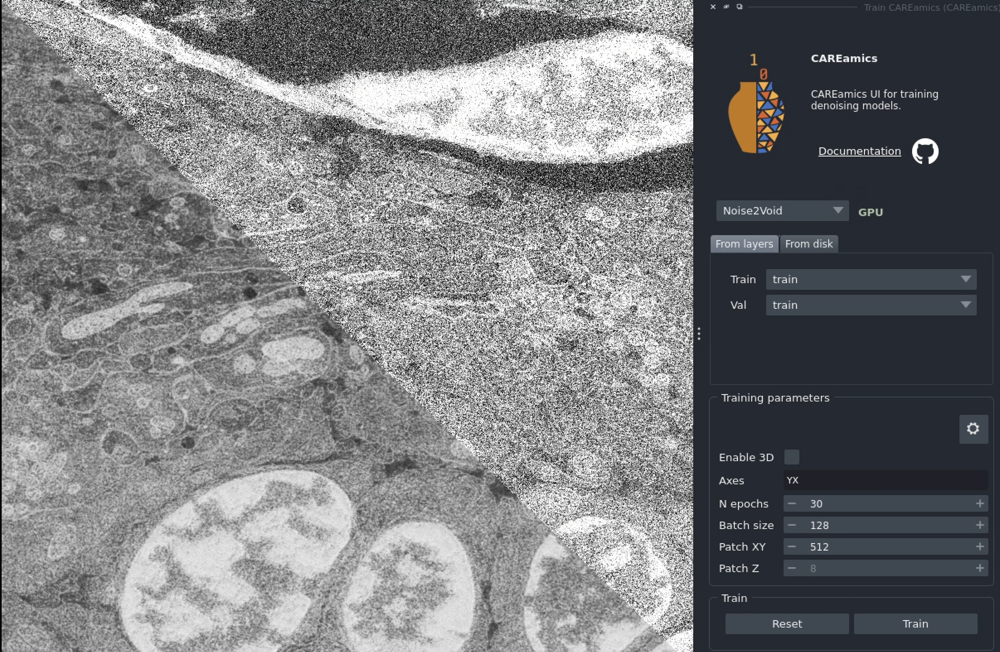
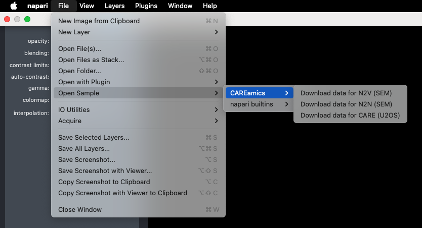
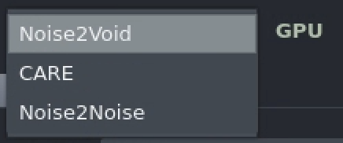
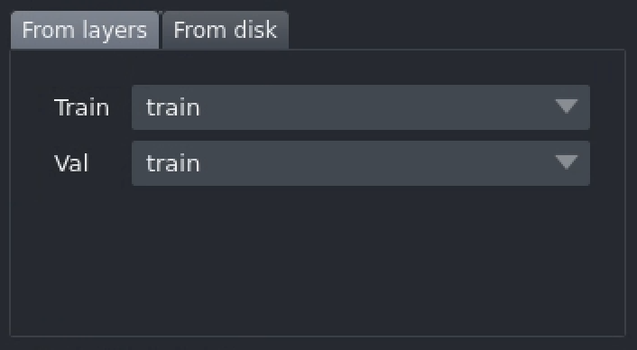
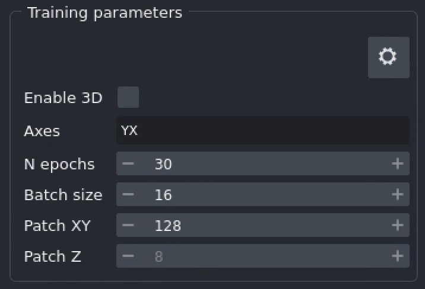
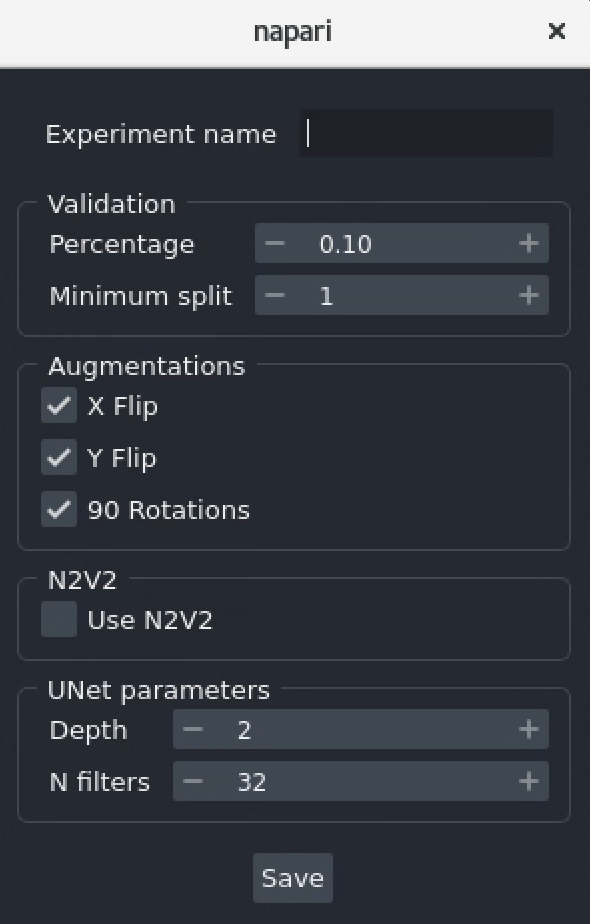
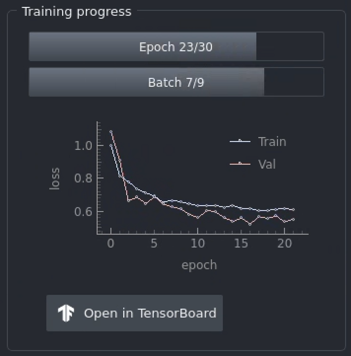
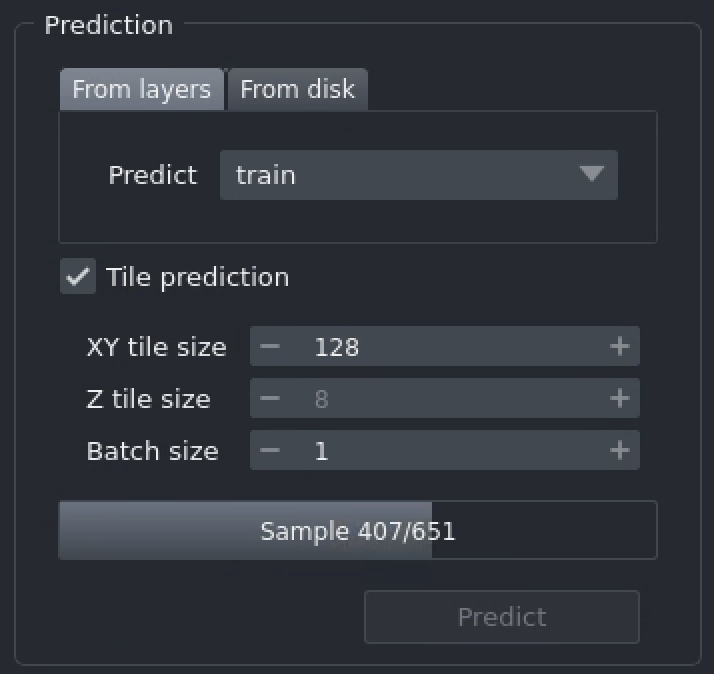
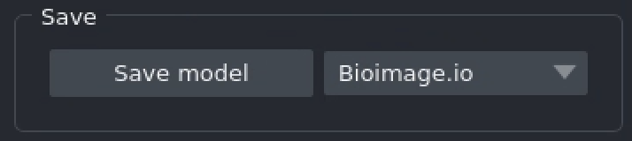

# CAREamics napari plugin

CAREamics provides a napari plugin for running our algorithms with a friendly GUI. Check
out the [installation instructions](../../installation.md) to get started.

<p align="center">

</p>

## Overview

The CAREamics napari plugin currently supports [CARE](../../algorithms/care), [Noise2Noise](../../algorithms/n2n), and [Noise2Void](../../algorithms/noise2void) algorithms. Users are guided from top to bottom through the following steps:

1. **Loading data**: Load data by using napari layers or from a folder.
2. **Training**: Train a model.
3. **Monitor training progress**: Monitor the training progress via a plot or TensorBoard.
4. **Prediction**: Predict on a layer or on files from a folder.
5. **Saving models**: Save the trained model for later use as [BioImage.io](bioimage.io) or PyTorch model.


## Quick start

The easiest way to try out the plugin, is to start the plugin and load a sample dataset. You can do this by running the following command in your terminal:

```bash
napari
```

Then, in the napari UI:

<p align="center">

</p>


## Documentation

In this section, we describe in more details the different elements of the UI.

!!! info "Having an issue?"

    In the header of the plugin, click on the Github icon to open an issue, we will be happy to help you!

### Algorithm

The first step is to select the algorithm you want to use via the drop-down menu.

<p align="center">

</p>

!!! info "GPU - CPU indicator"

    Next to the algorithm name, you can see a GPU - CPU indicator. This indicates whether the algorithm is running on the GPU or CPU. If you have a compatible GPU, the algorithm will run on it by default. If not, it will run on the CPU.


!!! important "GPU not available"

    If you expected the GPU-CPU indicator to be showing a green "GPU", but it isn't, then the problem is likely in the way your `conda` environment was set up.

    Make sure that you have a CUDA version that is compatible with your GPU and the PyTorch version you installed.

### Loading data

Loading data can be done either by using images already loaded in napari (`From layers`), or by loading images from a folder (`From disk`). The plugin will automatically detect the file format and load the images accordingly. The tab that is selected tells the plugin the source of the data.

Unsurprisingly, the `Train` data is used for training, and the `Val` one for validation. When using CARE, additional target train and validation data are required.

<p align="center">

</p>


!!! important "Size of the validatin data"

    If your validation data is too large, this will slow down training.


!!! tip "Split validation from training data"

    If you set the `Val` data to the same layers or folder as the `Train` data, the plugin will automatically split the data. There are two parameters used to control the amount of data used for validation, these are found in the advanced settings.

!!! info "Loading from a folder"

    Loading from a folder will not show the images in napari.

### Training

Once you have selected where the data is, nothing has happened yet! You can then set the training parameters.

<p align="center">

</p>

Here are the meaning of each of the parameters:

- `Enable 3D`: runs the training in 3D. This is only available if you set a `Z` axis in `Axes`.
- `Axes`: enter here the axes of your data. Accepted values are `C`, `Z`, `Y`, `X`, `T` and `S`. 
- `N epochs`: number of epochs for which to train the model. This parameter influences the total training time.
- `Batch size`: number of images to use in each training step. This parameter influences the total training time, but also the GPU memory used.
- `Patch XY`: size of the patches to use in the XY plane. This parameter impacts the GPU memory used.
- `Patch Z`: size of the patches to use in the Z plane. This parameter impacts the GPU memory used. It is only available if you set a `Z` axis in `Axes`.

Click on `Train` to start training. Training can be stopped at any time by clicking on the `Stop` button. The training will be saved. You can then`Reset` the model to start training again from scratch.


!!! tip "What to do when GPU memory is limited?"

    Often times, you will run out of GPU memory when training a model. This is especially true for 3D data. In this case, you can try to reduce the `Patch XY` and `Patch Z` parameters. This will reduce the size of the images used for training, and thus reduce the GPU memory used. 

    If this is not sufficient, you can also try to reduce the `Batch size` parameter. This will reduce the number of images used for training at each step, and thus reduce the GPU memory used. 


### Advanced settings

If you click on the gear icon in the top right corner of the training tab, you will see a list of advanced settings. These settings are not necessary to change for most users, but can be useful for advanced users.

<p align="center">

</p>

The parameters are the following:

- `Experiment name`: name of the experiment used in the logs.
- `Validation`
    - `Percentage`: percentage of the training data (number of patches or images, depending on whether the data is loaded fully in memory) used for validation.
    - `Minimum split`: minimum number of patches or images used for validation.
- `Augmentations`
    - `X Flip`: uncheck to disable the X flip augmentation.
    - `Y Flip`: uncheck to disable the Y flip augmentation.
    - `90 Rotations`: uncheck to disable the 90 degree rotations augmentation.
- `N2V2`: use [N2V2](../../algorithms/n2v2) rather than Noise2Void. Only available when training using Noise2Void (see algorithms).
- `UNet parameters`
    - `Depth`: depth of the UNet. Larger depth means more layers, and potentially a more powereful model. But it may also lead to overfitting, slower learning, and will take more memory on GPU.
    - `N filters`: number of filters in the first layer of the UNet. Larger number means more filters, and potentially a more powereful model. But it may also lead to overfitting, slower learning, and will take more memory on GPU.


### Monitoring training progress

While training, you can monitor the training progress via a plot or TensorBoard. Click on `Open in TensorBoard` to access the TensorBoard UI. 


<p align="center">

</p>


### Prediction

Once the training is finished, you can predict on a layer or on files from a folder. The tab that is selected tells the plugin the source of the data.

<p align="center">

</p>

Large image can be tiled for prediction. If you select `Tile prediction`, the following parameters will be available:

- `XY tile size`: size of the tiles in the XY plane. This parameter impacts the GPU memory used (less memory used per prediction for smaller sizes) and the duration of the prediction (longer prediction time for smaller sizes).
- `Z tile size`: size of the tiles in the Z plane. This parameter impacts the GPU memory used (less memory used per prediction for smaller sizes) and the duration of the prediction (longer prediction time for smaller sizes). It is only available if you set a `Z` axis in `Axes`.
- `Batch size`: number of images to use in each prediction step.

!!! tip "Image is too large"

    If your image is too large and causes the prediction to fail, you can use tiling to break it into smaller pieces that are manageable by your GPU memory.


!!! warning "Too many tiles"

    Currently, we have no way to stop prediction (other than stopping napari). If you have a large number of tiles (e.g. XY tile size too small), the prediction will take a long time!


### Saving models

Finally, you can save the trained model for later use. The plugin supports saving the model as a [BioImage.io](bioimage.io) model or a PyTorch model. 

<p align="center">

</p>