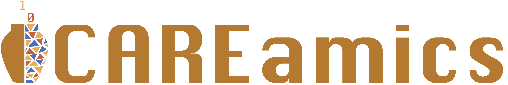

<figure markdown="span">
  { width="400" }
</figure>

# Documentation

CAREamics is a library aimed at simplifying the use of state of the art image
restoration deep-learning algorithms, from well-established algorithms (CARE, Noise2Void)
to cutting-edge methods (MicroSplit).

--8<-- "version.md"

## Getting Started

-   :octicons-desktop-download-24:{ .lg .middle } __Installation__

    ---

    Get started with CAREamics installation.

    [:octicons-arrow-right-24: Installation](./content/installation/)

-   :octicons-milestone-24:{ .lg .middle } __Features__

    ---

    What you can do with CAREamics.

    [:octicons-arrow-right-24: Features](./content/features/)

-   :octicons-repo-24:{ .lg .middle } __Guides__

    ---

    In-depth guides on CAREamics usage and features.

    [:octicons-arrow-right-24: Guides](./content/guides/)

-   :octicons-file-media-24:{ .lg .middle } __Applications__

    ---

    Examples of CAREamics in action on various datasets.

    [:octicons-arrow-right-24: Applications](https://github.com/CAREamics/careamics-examples/tree/a4e291ffd8f4f5378e951f6a01d99767ecedaed4/applications)

-   :octicons-cpu-24:{ .lg .middle } __Algorithms__

    ---

    Dive into the various CAREamics algorithms.

    <!-- [:octicons-arrow-right-24: Algorithms]() -->
    (Soon)

-   :octicons-code-24:{ .lg .middle } __API Reference__

    ---

    Code documentation for CAREamics.

    [:octicons-arrow-right-24: API Reference](./reference/)

## Feedback

If you are having trouble using the library or the napari plugin, contact us via the 
[Image.sc forum](https://forum.image.sc/).

We are always welcoming feedback on what to improve of what features could be useful,
therefore do not hesitate to open an issue on the
[Github repository](https://github.com/CAREamics/careamics)!

<!-- ## Cite us -->
