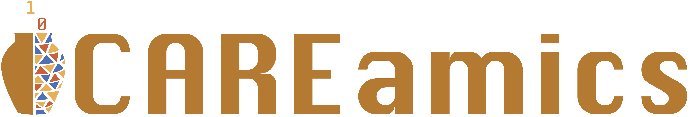

# Documentation

Documentation for [CAREamics v0.0.15](https://github.com/CAREamics/careamics/releases/tag/v0.0.15).

CAREamics is a PyTorch library aimed at simplifying the use of state of the art image
restoration deep-learning algorithms, such as CARE, Noise2Void, HDN, MicroSplit, etc.

## Getting Started

    

        

            

                <!-- New row -->
                

                    <!-- Installation -->
                    <a class="card-wrapper" href="installation">
                        

                            
 
                                

                                    
                                        --8<--  "desktop-download.svg"
                                    
                                

                                

                                    <h5>Installation</h5>
                                    

                                        Get started with CAREamics installation.
                                    

                                

                            

                        

                    </a>
                    <!-- Guides -->
                    <a class="card-wrapper" href="guides">
                        

                            

                                

                                    
                                        --8<-- "repo.svg"
                                    
                                

                                

                                    <h5>Guides</h5>
                                    

                                        In-depth guides on CAREamics usage and features.
                                    

                                

                            

                        

                    </a>
                

                <!-- New row -->
                

                    <!-- Application -->
                    <a class="card-wrapper" href="applications">
                        

                            

                                

                                    
                                        --8<-- "file-media.svg"
                                    
                                

                                

                                    <h5>Applications</h5>
                                    

                                        Examples of CAREamics in action on various datasets.
                                    

                                

                            

                        

                    </a>
                    <!-- Algorithms -->
                    <a class="card-wrapper" href="algorithms">
                        

                            

                                

                                    
                                        --8<-- "cpu.svg"
                                    
                                

                                

                                    <h5>Algorithms</h5>
                                    

                                        Dive into the various CAREamics algorithms.
                                    

                                

                            

                        

                    </a>
                

                <!-- New row -->
                

                    <!-- Code reference -->
                    <a class="card-wrapper" href="reference">
                        

                            

                                

                                    
                                        --8<-- "code.svg"
                                    
                                

                                

                                    <h5>API Documentation</h5>
                                    

                                        Code documentation for all CAREamics libraries.
                                    

                                

                            

                        

                    </a>
                

            

        

    

## Feedback

If you are having trouble using the library or the napari plugin, contact us via the 
[Image.sc forum](https://forum.image.sc/).

We are always welcoming feedback on what to improve of what features could be useful,
therefore do not hesitate to open an issue on the
[Github repository](https://github.com/CAREamics/careamics)!

<!-- ## Cite us -->
